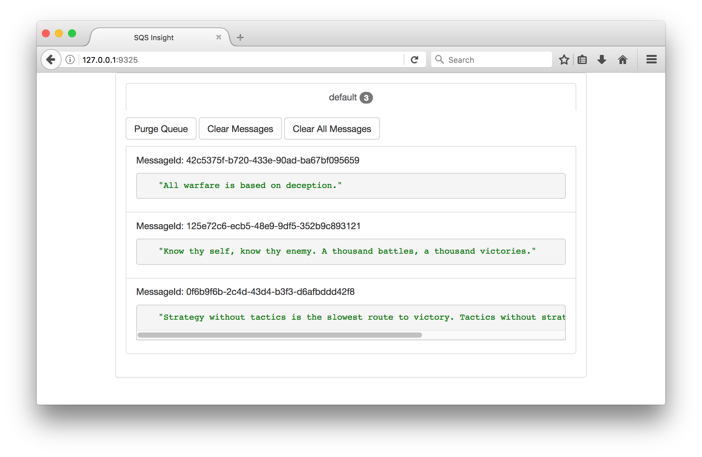

# Alpine SQS _(alpine-sqs)_

> Dockerized ElasticMQ server + web UI over Alpine Linux for local development.

Alpine SQS provides a containerized Java implementation of the Amazon Simple Queue Service (AWS-SQS). It is based on ElasticMQ running Alpine Linux and the Oracle Java 8 Server-JRE. It is compatible with AWS's API, CLI as well as the Amazon Java SDK. This allows for quicker local development without having to incurr in infrastructure costs.

The goal of this repository is to maintain an updated Docker environment for ElasticMQ with an integrated web UI for visualizing queues and messages.

## Table of Contents

- [Background](#background)
- [Install](#install)
- [Usage](#usage)
- [Maintainer](#maintainer)
- [Contribute](#contribute)
- [License](#license)

## Background
When searching for existing local implementations of SQS I came across a Docker image by [@vsouza](https://github.com/vsouza) called [docker-SQS-local](https://github.com/vsouza/docker-SQS-local) with over 11K pulls at the time. 

Using his work as inspiration I decided to improve upon it by implementing the following:

- Small as possible Docker image foot-print.
- Automatic update to the latest ElasticMQ server.
- Integrated UI for message-queue visualization.
- Automatic tests & builds.
- Thorough documentation.

### See also
For more information on the different projects this work is based on, please visit:

- [ElasticMQ](https://github.com/adamw/elasticmq) by [@adamw](https://github.com/adamw).
- [sqs-insight](https://github.com/finanzcheck/sqs-insight) by [finanzcheck](https://github.com/finanzcheck).
- [docker-alpine-java](https://github.com/anapsix/docker-alpine-java) by [anapsix](https://github.com/anapsix).

## Install
### Pre-requisites
### Pulling for Docker Hub
### Building from scratch

## Usage
### Running the environment
### Working with the default queue
### Creating new queues
### Sending a message
### Viewing messages
### Registering queues with the UI

- http://docs.aws.amazon.com/AWSSimpleQueueService/latest/SQSDeveloperGuide/sqs-create-queue.html

- http://docs.aws.amazon.com/cli/latest/reference/sqs/create-queue.html

- http://docs.aws.amazon.com/cli/latest/reference/sqs/receive-message.html

- Docker Compose Up & Build

## Maintainer
Ronald E. Oribio R. - [@roribio](https://github.com/roribio).

## Contribute
PRs are accepted and encouraged!

Please direct any questions, requests, or comments to the [Issues](https://github.com/roribio/alpine-sqs/issues) section of this project. 

**Note:** If editing this Readme, please conform to the [standard-readme](https://github.com/RichardLitt/standard-readme) specification.

## License
Copyright 2017 Ronald E. Oribio R.

This project is licensed under the GNU General Public License, version 3.0. See the [LICENSE](./LICENSE) file for details.
